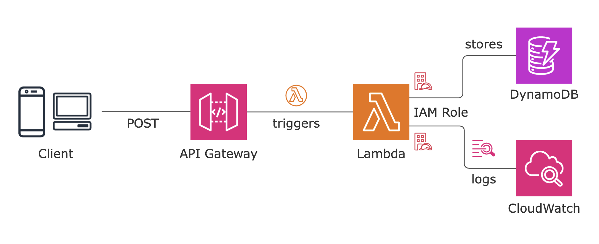

# Serverless-Registration-Form-WebApp-on-AWS

## AWS Architecture


## WebApp

### Step 1: Created a DynamoDB Table
```sh
Table Name: form-table
Partition key: email

```

### Step 2: Created an IAM Role for Lambda Function
```sh
IAM Role Name: RegistrationFormRole

Permissions:
1. CloudWatch Full Access
2. DynamoDB Full Access
```

### Step 3: Created and wrote a Lambda Function
```sh
Function Name: registration-form-function
Runtime: Python 3.9
```

### Step 4: Created API Gateway and Enable CORS
```sh
Access-Control-Allow-Origin: '*'
Access-Control-Allow-Headers: Content-Type,X-Amz-Date,Authorization,X-Api-Key,X-Amz-Security-Token
Access-Control-Allow-Methods: POST
```

### Step 5: Test the Project
